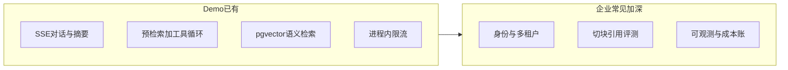
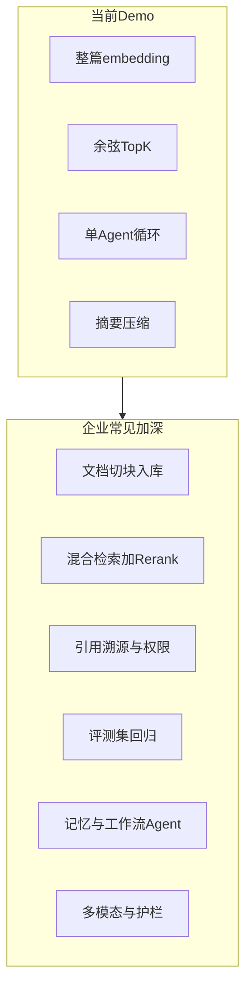

# 与企业级 AI 项目对照：当前还缺什么

> 本文对照企业内部知识助手 / RAG 平台的常见能力，说明本 Demo 已经覆盖什么、功能上还差哪一层、工程上还差哪一层。不是实现清单，也不要求一次补齐。

本仓库是教学闭环：对话、Agent、单库 RAG、Prompt 实验室、A/B 裁判都已跑通。企业级差距分两层：

- **深入功能**：同一条 AI 链路上，企业产品会再做厚的能力（本文重点）。
- **工程纪律**：登录隔离、安全、测试、可观测、迁移。没有这些，深入功能也很难安全地给多人用。

当前能力边界：

- 知识条目整篇一条向量（[kbStore.js](../server/src/data/kbStore.js)）
- Agent 三个工具、单循环最多 8 轮（[tools.js](../server/src/agent/tools.js)、[agent.service.js](../server/src/agent/agent.service.js)）
- 上下文是滑窗 + 摘要，没有长期记忆（[chat.js](../server/src/routes/chat.js)）
- 回答不强制带可点击引用

相关实现说明见 [后端开发指南](./后端开发指南.md)、概念见 [AI学习指南](./AI学习指南.md)。

---

## 一、已经具备

- 业务闭环：Chat Completions、Function Calling、Embedding、预检索 RAG、流式中断。
- 存储：PostgreSQL + pgvector（HNSW）、会话事务写入、JSON 种子迁移。
- 运维雏形：`/api/health` 探库、进程限流、`trust proxy`、优雅关闭、Sealos 文档、`docker-compose` 起库。
- 产品实验：Prompt 在线编辑、messages 预览、参数滑块、A/B + LLM-as-judge。

差距主要不在「会不会调模型」，而在知识怎么用、答案能不能追溯、质量能不能回归，以及谁能用、出事怎么查。

---

## 二、深入功能缺口

### 1. RAG 知识工程（最大功能落差）

| 企业常见 | 当前项目 |
|----------|----------|
| PDF/网页/仓库入库、异步解析 | 手工填 title/content 短条目 |
| 切块（按标题/语义/重叠窗口） | 一条知识 = 一个 1024 维向量 |
| 混合检索 BM25 + 向量，再 Cross-Encoder Rerank | 仅 pgvector `<=>`，无二排 |
| 答案带 chunk 引用、原文高亮、过期文档降权 | `formatSearchResultText` 拼进 prompt，前端无溯源点击 |
| 多知识库、元数据过滤（部门/密级/时间） | 全局一张 `kb_entries` |
| Query 改写 / HyDE / 多路召回 | 用户原句直接 embed |
| Graph RAG、FAQ 与非结构化分流 | 无 |

没有切块和引用，企业里最怕的「模型编造据知识库」只能靠预检索缓解，无法审计「这句话来自第几段」。

### 2. Agent 编排深度

现状：ReAct 单循环 + 预检索；工具是搜知识库、查 npm、本地代码统计。

还缺：工具超时/重试/熔断、危险操作人工确认、并行 `tool_calls`、规划与执行分离（Plan-then-Execute）、多 Agent 分工、持久化技能 / MCP 插件、代码执行沙箱、浏览器/内部系统只读 API、失败补偿。`analyze_code` 只做正则统计，不是 AST / 安全扫描。

### 3. 记忆与上下文

现状：最近 6 条原文 + `sessions.summary`。

企业还要：跨会话用户记忆、实体/偏好抽取、按相关性召回历史（Memory RAG）、会话分支、精确 tokenizer 动态摘要、多模态上下文（图/语音）。前端 `view` 存在组件 state 里，刷新即丢，也没有会话分享/导出。

### 4. 质量闭环（比单次 A/B 更深）

现状：CompareLab 一次两路 + 四维裁判（[judge.service.js](../server/src/services/judge.service.js)）。

企业要：固定黄金集、RAGAS/命中率回归、点赞点踩回流、人工抽检队列、Prompt/知识库版本与回滚、坏 case 自动入库。没有「改了一条知识或换 embedding，CI 告诉你检索是否变差」。

### 5. 生成侧产品功能

- 结构化输出（JSON Schema / 表格落库），不仅是 Markdown 聊天。
- 护栏：注入检测、主题越权、敏感词、工具出站策略。
- 流式中的「可引用片段」与中断后续写。
- 多模型路由（简单题 turbo、难推理 max）、缓存语义相同问题。
- 语音输入输出、看图（Qwen-VL）——[AI学习指南](./AI学习指南.md) 进阶方向已写，产品未做。

### 6. 知识库作为产品本身

企业知识库是平台：权限、审批发布、去重、新鲜度、目录树、全文检索控制台、用量（哪篇被引用最多）。当前是单用户 CRUD + 检索对比教学面板。

---

## 三、工程缺口（功能之外）

没有登录时，[history](../server/src/routes/history.js) / [knowledge](../server/src/routes/knowledge.js) / [prompts](../server/src/routes/prompts.js) **全库共享**，谁都能删别人的会话和知识条目。

| 缺口 | 现状 | 企业常见 |
|------|------|----------|
| 身份与隔离 | 无登录 | OIDC/JWT、RBAC、行级 `org_id` |
| 安全基线 | [`cors()` 全开放](../server/src/app.js) | 白名单、Helmet、schema 校验、密钥托管、审计 |
| 测试与 CI | 无自动化测试 | 单测 + 集成 + SSE 契约 + PR 流水线 |
| 可观测与成本 | `console.log`；`usage` 挂在单条消息 | requestId、Tracing、按租户 token 账单、日配额 |
| 限流 | 进程内存 `express-rate-limit` | 多实例需 Redis |
| Schema 演进 | `CREATE TABLE IF NOT EXISTS` | 版本化 migration；换 `EMBEDDING_DIM` 需重建 |
| 列表 | `listEntries` 全表拉取 | 分页 |
| 交付形态 | 仅库的 compose | 应用镜像、多环境、OpenAPI |

---

## 四、建议优先级

教学项目不必做成中台。两条路线可以分开走。

**若目标是功能上更像企业内部知识助手：**

1. 文档上传 + 切块入库 + 回答带引用
2. 关键词 + 向量混合检索，可选 Rerank
3. 固定 20～50 条问答评测集，检索/回答可回归
4. 用户反馈（有用/无用）写入库
5. Agent 工具超时与人工确认（写操作时）

切块 + 引用 + 评测集，比再堆模型或再加十个玩具工具更能拉开与 Demo 的差距。

**若目标是能给小团队内网用：**

1. 登录 + 数据按用户隔离
2. 请求校验 + CORS / Helmet
3. 版本化 SQL 迁移 + 列表分页
4. 结构化日志 + token 用量汇总
5. 冒烟测试 + CI（lint / test / build）

完整企业级还要合规、SLA、多活和平台化 RAG，那是另一条产品线。当前代码作为教学闭环是够的。
